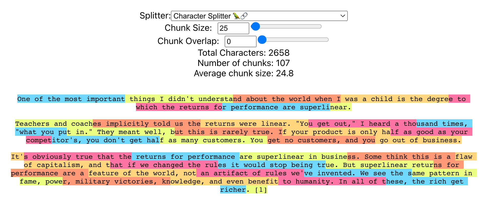

# Chunk Viz

This is a tool to visualize how different text splitters chunk up text

[See the demo](https://www.chunkviz.com/)

[Explainer Video](https://twitter.com/GregKamradt/status/1733208049513611339)

## Installation and Running Instructions

Follow these steps to download and run the application on your local machine.

### Prerequisites

Before you begin, ensure you have [Node.js](https://nodejs.org/) installed on your system.

### Step 1: Clone the Repository

First, clone the repository to your local machine using the following command:
`git clone https://github.com/gkamradt/ChunkViz`

### Step 2: Install Dependencies

Navigate to the cloned repository's directory and install the necessary dependencies:

`cd ChunkViz`

`npm install`

### Step 3: Build the Application

`npm run build`

### Step 4: Run locally

`npm start`

Made with ❤️ by [Greg Kamradt](https://twitter.com/GregKamradt)

## License

This project is licensed under the MIT License - see the [LICENSE](LICENSE.txt) file for details. Use of this software requires attribution to the original author and project, as detailed in the license.ChC